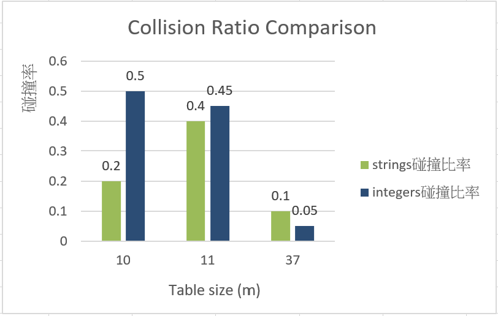

# Homework Assignment IV: Hash Function Design & Observation (C/C++ Version)

This assignment focuses on the design and observation of hash functions using C/C++. 
Students are expected to implement and analyze the behavior of hash functions, 
evaluate their efficiency, and understand their applications in computer science.

Developer: 林晉霆  
Email: s1133322@mail.yzu.edu.tw 

## Environment 
本程式於 **Windows** 作業系統環境中開發，並使用 **Visual Studio Code(VS Code)** 作為主要的整合式開發環境。程式碼以 **Git** 進行版本控制，並連接至 **GitHub** 遠端儲存庫以進行同步與協作。此程式使用 **cl.exe** 作為編譯器。

## My Hash Function
### Integer Keys 
- Formula / pseudocode:
  ```text
  myHashInt(key, m):
      r = digits(key) reversed
      RETURN (r * BASE + key) MOD m
  ```
- Rationale: 把整數的位數先反轉，再用乘法放大差異，最後用質數大小的 m 去做 MOD，讓整體分佈更平均，減少碰撞。

### Non-integer Keys
- Formula / pseudocode:
  ```text
  myHashString(str, m):
      hash = 0
      FOR each character c in str:
          num = charToNum(c)
          IF num is valid:
              hash = hash * BASE + num
      RETURN hash MOD m
  ```
- Rationale: 把字串逐字轉成數字並用乘法累加，不讓相似的字串算出的結果相近，再搭配用質數大小的 m 去做 MOD，讓字串分佈較均勻、減少碰撞。

## Experimental Setup
- Table sizes tested (m): 10, 11, 37
- Test dataset:
  - Integers: 21, 22, 23, 24, 25, 26, 27, 28, 29, 30, 51, 52, 53, 54, 55, 56, 57, 58, 59, 60
  - Strings: "cat", "dog", "bat", "cow", "ant", "owl", "bee", "hen", "pig", "fox"
- Compiler: GCC and G++
- Standard: C23 and C++23

## Results
- For integers:
  | Table Size (m) | Index Sequence                                                              | Observation                       |
    |----------------|---------------------------------------------------------------------------|-----------------------------------|
    | 10             | 3, 4, 5, 6, 7, 8, 9, 0, 1, 3, 6, 7, 8, 9, 0, 1, 2, 3, 4, 6                | Index 呈現循環、重複明顯          |
    | 11             | 8, 0, 3, 6, 9, 1, 4, 7, 10, 2, 10, 2, 5, 8, 0, 3, 6, 9, 1, 4              | 部分 Index 重複                   |
    | 37             | 23, 1, 16, 31, 9, 24, 2, 17, 32, 12, 35, 13, 28, 6, 21, 36, 14, 29, 7, 24 | Near-uniform、Index 無明顯規律    |

- For strings:
  | Table Size (m) | Index Sequence                         | Observation                    |
  |----------------|----------------------------------------|--------------------------------|
  | 10             | 9, 1, 8, 6, 0, 5, 7, 2, 7, 0           | 無週期性、部分 Index 重複      |
  | 11             | 6, 2, 2, 3, 5, 2, 1, 1, 7, 5           | 無週期性、部分 Index 重複      |
  | 37             | 9, 22, 10, 2, 7, 5, 8, 11, 9, 0        | Near-uniform、數值跳動幅度大   |

## Compilation, Build, Execution, and Output

### Compilation (Windows / cl.exe)
- The project uses a comprehensive Makefile that builds both C and C++ versions with proper flags:
  ```cmd
  # Build both C and C++ versions
  Makefile.bat all
  
  # Build only C version
  Makefile.bat c
  
  # Build only C++ version
  Makefile.bat cxx 
  ```

### Manual Compilation (if needed) (Windows)
- Command for C:
  ```cmd
  cl.exe /EHsc C\main.c C\hash_fn.c /Fe:C\hash_function.exe
  ```
- Command for C++:
  ```cmd
  cl.exe /EHsc CXX\main.cpp CXX\hash_fn.cpp /Fe:CXX\hash_function_cpp.exe
  ```

### Clean Build Files (Windows / cl.exe)
- Remove all compiled files:
  ```cmd
  Makefile.bat clean
  ```

### Execution
- Run the compiled binary:
  ```cmd
  C\hash_function.exe
  ```
  or
  ```cmd
  CXX\hash_function_cpp.exe
  ```

### Result Snapshot
- Example output for integers:
  ```
	=== Hash Function Observation (C++ Version) ===

	=== Table Size m = 10 ===
	Key     Index
	-----------------
	21      3
	22      4
	23      5
	24      6
	25      7
	26      8
	27      9
	28      0
	29      1
	30      3
	51      6
	52      7
	53      8
	54      9
	55      0
	56      1
	57      2
	58      3
	59      4
	60      6

	=== Table Size m = 11 ===
	Key     Index
	-----------------
	21      8
	22      0
	23      3
	24      6
	25      9
	26      1
	27      4
	28      7
	29      10
	30      2
	51      10
	52      2
	53      5
	54      8
	55      0
	56      3
	57      6
	58      9
	59      1
	60      4

	=== Table Size m = 37 ===
	Key     Index
	-----------------
	21      23
	22      1
	23      16
	24      31
	25      9
	26      24
	27      2
	28      17
	29      32
	30      12
	51      35
	52      13
	53      28
	54      6
	55      21
	56      36
	57      14
	58      29
	59      7
	60      24
  ```

- Example output for strings:
  ```
	=== String Hash (m = 10) ===
	Key     Index
	-----------------
	cat     9
	dog     1
	bat     8
	cow     6
	ant     0
	owl     5
	bee     7
	hen     2
	pig     7
	fox     0

	=== String Hash (m = 11) ===
	Key     Index
	-----------------
	cat     6
	dog     2
	bat     2
	cow     3
	ant     5
	owl     2
	bee     1
	hen     1
	pig     7
	fox     5

	=== String Hash (m = 37) ===
	Key     Index
	-----------------
	cat     9
	dog     22
	bat     10
	cow     2
	ant     7
	owl     5
	bee     8
	hen     11
	pig     9
	fox     0

  ```

- Observations: Outputs align with the analysis, showing better distribution with prime table sizes.
- Example output for integers:
  ```
  Hash table (m=10): [3, 4, 5, 6, 7, 8, 9, 0, 1, 3, 6, 7, 8, 9, 0, 1, 2, 3, 4, 6]
  Hash table (m=11): [8, 0, 3, 6, 9, 1, 4, 7, 10, 2, 10, 2, 5, 8, 0, 3, 6, 9, 1, 4]
  Hash table (m=37): [23, 1, 16, 31, 9, 24, 2, 17, 32, 12, 35, 13, 28, 6, 21, 36, 14, 29, 7, 24]
  ```
- Example output for strings:
  ```
  Hash table (m=10): [9, 1, 8, 6, 0, 5, 7, 2, 7, 0]
  Hash table (m=11): [6, 2, 2, 3, 5, 2, 1, 1, 7, 5]
  Hash table (m=37): [9, 22, 10, 2, 7, 5, 8, 11, 9, 0]
  ```
- Observations: Outputs align with the analysis, showing better distribution with prime table sizes.

## Analysis
- Prime vs non-prime `m`: Prime table sizes generally result in better distribution and fewer collisions.
  ##### 根據結果繪製碰撞率比較圖，可以清楚看出：
  

  ##### 1. 以質數(prime)作為 table size 時，碰撞率顯著較低
  > 圖中顯示，質數 m=11、m=37 的碰撞率都比非質數 m=10 更低，尤其是 m=37 (strings=0.1, integers=0.05) 明顯分佈最均勻、碰撞最少。

  ##### 2. 非質數(non-prime)有明顯的 clustering 與高碰撞率
  > 圖中顯示非質數m=10時，strings 碰撞率=0.2; integers 碰撞率達一半，容易大量集中到同一區，造成高碰撞率。

  ##### 因此，符合雜湊理論：使用質數作為 table size 能減少 clustering，使分佈更均勻(碰撞少)。

- Patterns or collisions: Non-prime table sizes tend to produce repetitive patterns, leading to more collisions.
  > 觀察 integers 測試結果，非質數 m=10 呈現明顯 pattern，執行結果產生重複 index 循環(6->7->8->9->0)，造成 index 聚集在少數區域，形成 clustering，造成高碰撞率。相較之下，質數 m=37 則分佈較均勻。

- Improvements: Use a prime table size and a well-designed hash function to enhance distribution.
  >1.使用質數(prime) 作為雜湊表大小，可避免產生週期性重複，分佈更均勻。<br>
  >2.採用好的雜湊函數設計可減少 clustering 現象。

## Reflection
1. Designing hash functions requires balancing simplicity and effectiveness to minimize collisions.
2. Table size significantly impacts the uniformity of the hash distribution, with prime sizes performing better.
3. The design using a prime table size and a linear transformation formula produced the most uniform index sequence.
>
針對上述 Reflection，在設計 hash function 時，我的考量與反思如下：
1. **簡單性與效果**  
我選擇線性轉換公式，計算簡單且能把索引分散開。我認為 hash 的主要作用是希望可以快速找到資料，雖然複雜的公式碰撞可能少一點，但運算會變慢，查找效率就會受到影響。因此，簡單又合理的公式是一個必要的平衡，既能維持速度，也能減少碰撞集中。

2. **m 大小**  
我測試非質數(10)與質數(11、37)作為表格大小。結果顯示，質數表格分布較均勻、碰撞較少，因為它可以避免索引循環或集中；非質數表格則容易出現 clustering，碰撞率較高。不過，資料量少時這種差異不明顯，而表格太大又會浪費記憶體；資料量多時，質數表格的優勢就比較明顯。綜合考量，選擇比資料量略大一點的質數作表格大小，似乎能兼顧分佈均勻與資源使用效率

3. **hash function設計**  
   對整數採位數反轉再用乘法累加；對字串則是將每個字元(A-Z, a-z)轉成數字(0~52)再累加乘法。這樣設計可以讓相似的資料映射到不同的索引，避免碰撞集中。  

最後，我也發現一些參數(例如BASE)，理論上可以設成比實際資料量略大一點的質數，但仍需透過實際驗證來找最合適的值。而且資料的分佈也會影響 hash table，例如整數連續或字串長短不一樣，碰撞率可能差很多。因此，在設計時必須考慮這些因素，並透過觀察資料與驗證結果來調整。
