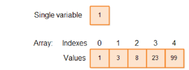

# 陣列 (Array)

## 1️⃣ Description
- 陣列在記憶體中是**連續儲存**的，因此可以透過索引以 **O(1)** 的時間快速存取元素。
- 因為記憶體空間是連續的，如果在陣列中間進行插入或刪除，就必須搬移大量元素，所以插入和刪除的時間複雜度通常為 **O(n)**。
- 陣列裡的元素不是「真正刪除」，而是以後面的元素去覆蓋前面的元素來達成效果。


## 2️⃣ Visualization 
  
## 3️⃣ Abstract Data Type

| 操作 | 說明 | 時間複雜度 |
|------|------|------------|
| Access / Update | 直接利用索引定位 | O(1) |
| Insert / Delete | 必須搬移後續元素以保持連續性 | O(n) |
| Traversal | 逐一走訪每個元素 | O(n) |

---

## 4️⃣ Array Declaration
- Static Array
> 
```c
//宣告
int a[10];	

//Initialization
int a[10] = {1,2,3,4,5,6,7,8,9,10}; 

//Access
cout<<a[1];

//Traverse
for (int i = 0; i < 10; i++) {
    cout<<a[i]<<" ";
}
```
- Dynamic Array
>
```c

//宣告與記憶體配置
int *a;
int n = 10;
a = (int *) malloc(n * sizeof(int));

//初始化
for (int i = 0; i < n; i++) {
	a [i] = i + 1;
}

//存取、遍歷
for (int i = 0; i < 10; i++) { 
	cout<<a[i]<<" "; 
}

```

## 5️⃣ 調整陣列大小
- 使用 realloc() 將原本的陣列空間擴大為原本的兩倍。 
- 如果 realloc() 成功 → 新陣列自動包含原資料；失敗 → 必須處理記憶體釋放避免記憶體洩漏（free()）
>
```c
n = n * 2;
int *temp = (int *) realloc(a, n * sizeof(int)); 
if (temp == NULL) { 
	free(a); 
	return -1; 
}
```
## 6️⃣ Practice 
- LeetCode 704 - Binary Search（二分查找）
>
```c
class Solution { 
public: 
	int search(vector<int>& nums, int target) { 
		int low = 0; 
		int high = nums.size() - 1;
		while (low <= high) { 
			int mid = (low + high) / 2;
			if (nums[mid] == target) 
				return mid; 
			else if (nums[mid] > target) 
				high = mid - 1; 
			else 
				low = mid + 1; 
		}
		return -1; 
	} 
};
```

- LeetCode 27 - 移除元素(快慢指針)
>
```c
class Solution {
public:
	int removeElement(vector<int>& nums, int val) {
		int k = 0;
		for (int i = 0; i < nums.size(); i++) {
			if (nums[i] != val) {
				nums[k++] = nums[i];
			}
		}
		return k; // new length
	}
};
```