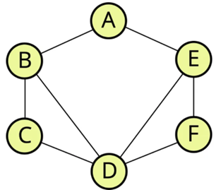
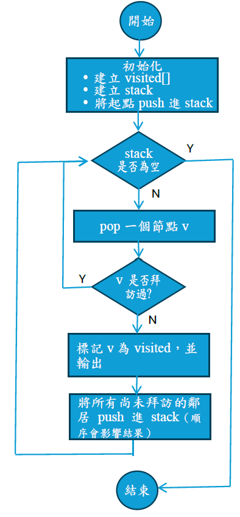
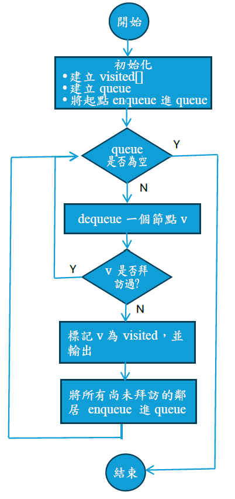
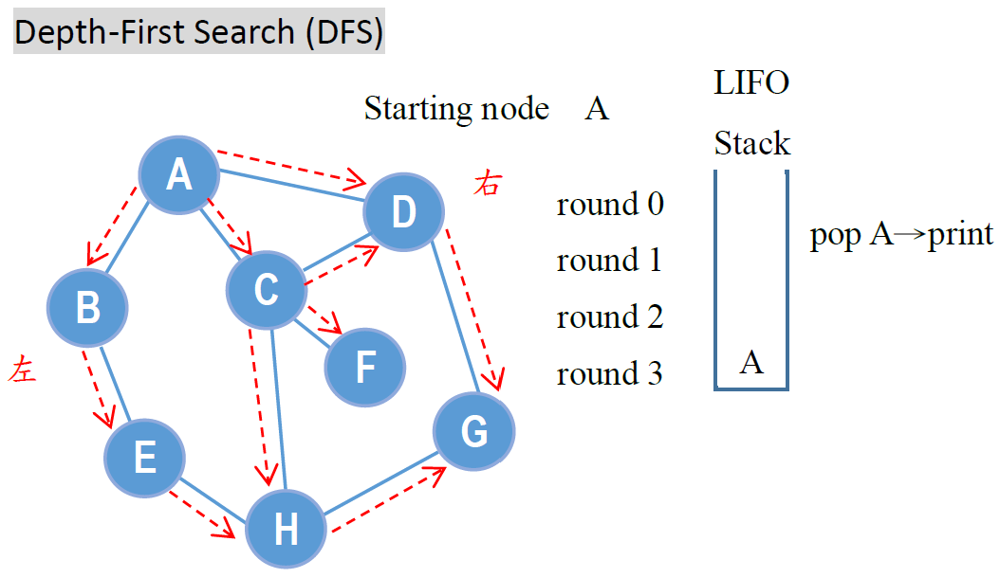
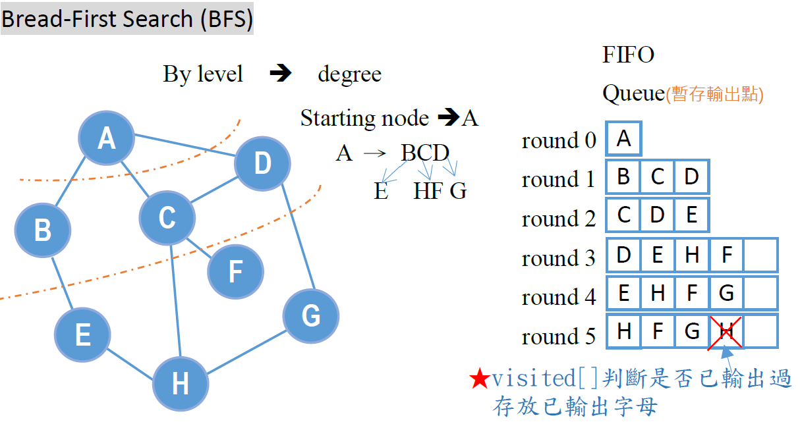

# 圖（Graph）

## 1️⃣ Description
> **圖（Graph）** 為 G=(V,E)，其中 V 是節點集合，E 是連接節點的邊集合，邊可為無向或有向，用以表示節點之間的關係。

## 2️⃣ Visualization 
  
## 3️⃣ Classification
- 無向圖（Undirected Graph）：圖中的邊沒有方向，任兩個相連節點之間皆可雙向到達。
- 有向圖（Directed Graph）：圖中的邊具有方向性，表示由一個節點指向另一個節點。
- 加權圖（Weighted Graph）：圖中每一條邊都附有權重，用來表示距離、成本或時間等。
- 無加權圖（Unweighted Graph）：圖中所有邊視為一樣重要，不考慮權重。
- 循環圖（Cyclic Graph）：圖中存在至少一條路徑，其起點與終點為同一個節點。
- 無環圖（Acyclic Graph）：圖中不存在任何循環路徑。
- 連通圖（Connected Graph）：圖中任意兩個節點之間皆存在一條路徑，每個節點都能互相連通。
- 不連通圖（Disconnected Graph）：圖中有些節點彼此走不到對方，整個圖分成幾個互相不連通的小群組。

## 4️⃣ Adjacency Matrix VS. Adjacency List

| 比較項目 | 鄰接矩陣(Adjacency Matrix) | 鄰接串列(Adjacency List) |
|------|------|------------|
| 空間複雜度 | O(V^2) | o(V+E) |
| 空間使用效率 | 稀疏圖浪費空間 | 幾乎不浪費 |
| 判斷兩點是否相連 | O(1)快 | O(degree) |
| 列出某點所有鄰居 | 要掃一整列O(V) | 直接走串列 |
| 適合圖形 | 稠密圖(節點多、連線多) | 稀疏圖(節點多、連線少) |
| 常用演算法 | Floyd-Warshall | BFS、DFS、Dijkstra |

- Adjacency Matrix:二維array，可記錄的連線
- Adjacency List: linked list 存放點和點之間鄰近的資訊

## 5️⃣ Graph vs. Tree

| 項目 | 圖（Graph） | 樹（Tree） |
|---------|------------|------------|
| **定義** | 節點與邊所組成的結構 | 一種沒有循環、只有一條路徑連到每個節點的特殊圖 |
| **環（Cycle）** | 可能存在 | 不存在 |
| **連通性** | 可連通或不連通 | 一定連通 |
| **父子關係** | 無父子結構 | 有明確父子關係 |
| **路徑數量** | 兩節點間可能有多條路徑 | 兩節點間只有一條路徑 |
| **方向性** | 可以有方向性 | 通常無方向性 |
| **邊的數量** | 無限制 | 邊數 = 節點數 − 1 |
| **遍歷需求** | 須記錄 visited(避免重複) | 不需 visited |
| **演算法** | BFS、DFS、Dijkstra | 前序 / 中序 / 後序 |

## 6️⃣ DFS vs. BFS

| DFS | BFS |
|------|------|
| DFS（Depth-First Search）—「先走到底」 | BFS（Breadth-First Search）—「一層一層來」 |
| 一組最簡單步驟（Stack / 遞迴） | 一組最簡單步驟（Queue） |
|  |  |
|  |  |