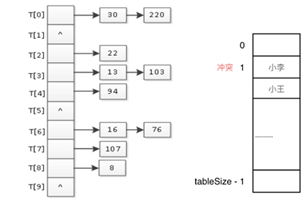
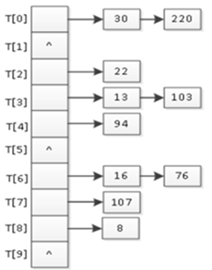
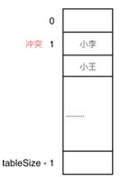

# 雜湊表（Hash Table）

## 1️⃣ Description
> **Hash Table** 是一種可以用O(1)時間找到資料的結構。可以把 **Hash Table** 想成「有特別索引規則的陣列」。
> 
- 陣列用下標找元素
- **Hash Table** 用 **Hash Function** (負責把資料轉換成一個數字 (索引))算出來的下標找元素

## 2️⃣ Visualization 
  
## 3️⃣ Abstract Data Type
- Hash Collision
> 如果兩個不同的資料「Hash Function算出同一個索引位置」就會Collision。
> 
| 方法 | 方式 | 示意 |
|------|------|------------|
| Chaining | 同一位置用鏈表串起來 |  |
| Linear Probing | 如果位置被占，就往後找下一個空位 |  |

- Extend
> 當我們使用「Hash Table」來解題，通常會使用:
>
| 類型 | 目的 |
|------|------|
| array | 適用於 key 能直接對應為索引（如字元、數字），速度最快 |
| set | 用來判斷某值是否存在 |
| map | 用 key 查對應的 value |

- C++ 中 set 系列

| 容器 | 底層結構 | 是否有序 | 是否可重複 | key 可否修改 | 查詢效率 | 插入/刪除效率 |
|------|------|------|------|------|------|------|
| std::set | 紅黑樹 | 有序 | ❌ | ❌ | O(log n) | O(log n) |
| std::multiset | 紅黑樹 | 有序 | ✅ | ❌ | O(log n) | O(log n) |
| std::unordered_set | 哈希表 | 無序 | ❌ | ❌ | O(1) | O(1) |

> 因為set / multiset依靠「紅黑樹」維持 key 的排序，一旦修改 key 會破壞整棵樹結構。所以正確作法：刪除舊 key → 再插入新 key。

- C++ 中 map 系列

| 容器 | 底層結構 | 是否有序 | 是否可重複 | key 可否修改 | 查詢效率 | 插入/刪除效率 |
|------|------|------|------|------|------|------|
| std::map | 紅黑樹 | 有序 | ❌ | ❌ | O(log n) | O(log n) |
| std::multimap | 紅黑樹 | 有序 | ✅ | ❌ | O(log n) | O(log n) |
| std::unordered_map | 哈希表 | 無序 | ❌ | ❌ | O(1) | O(1) |

## 4️⃣ Practice 
- LeetCode 242 - Valid Anagram
```c

//判斷兩個字串是否為 Anagram
class Solution {
public:
	bool isAnagram(string s, string t) {
		//用陣列模擬 Hash Table，儲存每個字母出現次數
		int r[26] = {0};
		
		//統計字串 s 中每個字母出現的次數
		for (int i = 0; i < s.size(); i++) {
			r[s[i] - 'a']++;
		}
		
		//減去字串 t 中每個字母出現的次數
		for (int i = 0; i < t.size(); i++) {
			r[t[i] - 'a']--;
		}
		
		//檢查字母的統計個數是否為 0
		for (int i = 0; i < 26; i++) {
			if (r[i] != 0) {
				return false;
			}
		}
		return true; // 全部為 0，表示兩個字串是Anagram
	}
};
```

- LeetCode 1002 - Find Common Characters
```c
class Solution {
public:
    vector<string> commonChars(vector<string>& words) {
        vector<string> result;
        if (words.empty()) return result; // 如果字串陣列為空，直接回傳空
        
        int hash_counts[26] = {0}; 
        
        // 統計第一個字串每個字母的出現次數
        for (char c : words[0]) {
            hash_counts[c - 'a']++;
        }
        
        // 遍歷剩下的字串，更新共同字母次數
        for (int i = 1; i < words.size(); i++) {
            int other_counts[26] = {0};
            for (char c : words[i]) {
                other_counts[c - 'a']++;
            }
           
            for (int k = 0; k < 26; k++) {
                hash_counts[k] = min(hash_counts[k], other_counts[k]);
            }
        }
        
        for (int i = 0; i < 26; i++) {
            while (hash_counts[i] > 0) {
                result.push_back(string(1, char(i + 'a')));
                hash_counts[i]--;
            }
        }
        
        return result;
    }
};

```