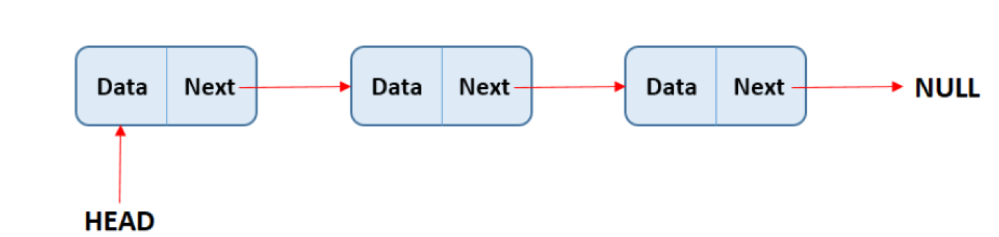
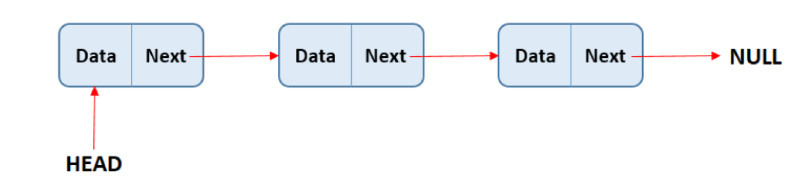
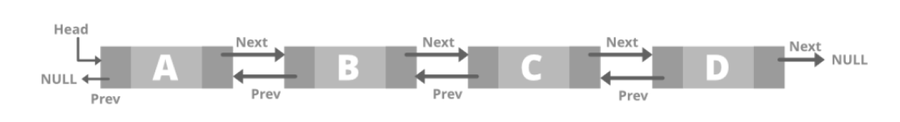
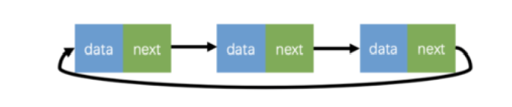

# 鏈結串列（Linked List）

## 1️⃣ Description
- **Linked List**是由指標將節點串接起來的線性資料結構。
- 每一個節點由兩個部分組成：
    - **資料（data）**：用來儲存資料
    - **指標（next）**：用來儲存指向下一個節點(Node)的指標
- 而最後一個節點的指標會指向 null（代表不再連接其他節點）。鏈結串列的起始位置稱為頭節點（Head）。

## 2️⃣ Visualization 
  
## 3️⃣ Abstract Data Type

| 操作 | 說明 | 單向鏈結串列時間複雜度 |
|------|------|------------|
| Create | 建立空鏈結串列 | O(1) |
| Traverse | 從頭走到尾依序訪問節點 | O(n) |
| Search(value) | 找某個值是否存在 | O(n) |
| Insert(pos) | 在指定位置插入新節點（需先走到該位置） | O(n) |
| Delete(pos) | 刪除指定位置節點（需先走到該位置）| O(n) |
| Insert at Head | 頭部插入節點 | O(1) |
| Delete at Head | 頭部刪除節點 | O(1) |
| Update(pos, value) | 修改某位置節點資料（需先找到該節點）| O(n) |

---

## 4️⃣ Linked List Type
- 單鏈表
  
- 雙向鏈表
  

- 環狀鏈表
  

## 5️⃣ Linked List Declaration
- Declaration
```c
struct Node {
	int val; // 可選的任意資料
	Node* next // 下一個節點
}
```
- Initialization
```c
int main() {
	Node* head = new Node();
	head->val = 10;
}
```
- Add a new node
```c
head->next = new Node();
head->next->val = 30;
```

- Insert a new node
```c
Node *temp = node->next;
node->next = new Node();
node->next->val = 20;
node->next->next = temp;
```
- travel
```c
Node *node = head;
while(node) {
	cout << node->val << ' ';
	node = node->next;
}
```

## 6️⃣ Practice 
- LeetCode 707 - Design Linked List
```c
class MyLinkedList { 
public: 
	struct Node { 
		int val; 
		Node* next; 
		Node(int val):val(val), next(nullptr){} 
	};
	
	MyLinkedList() { 
		head=new Node(0); 
		size=0; 
	} 
	
	int get(int index) { 
		if (index>(size-1) || index<0) { 
			return -1; 
		} 
		
		Node* curr=head->next; 
		for(int i=0;i<index;i++){ 
			curr=curr->next; 
		} 
		return curr->val; 
	} 
	
	void addAtHead(int val) { 
		Node* newNode =new Node(val); 
		newNode->next=head->next;
		head->next=newNode; 
		size++; 
	} 
	
	void addAtTail(int val) { 
		Node* newNode =new Node(val); 
		Node* curr=head; 
		while(curr->next!=nullptr){ 
			curr=curr->next; 
		} 
		
		curr->next=newNode; 
		size++; 
	} 
	
	void addAtIndex(int index, int val) { 
		if(index>size) return; 
		if(index<0) index = 0; 
		Node* newNode =new Node(val); 
		Node* curr=head; 
		for(int i=0;i<index;i++){ 
			curr=curr->next; 
		} 
		
		newNode->next=curr->next; 
		curr->next=newNode; 
		size++; 
	} 
	
	void deleteAtIndex(int index) { 
		if (index<0 || index>=size) return; 
		Node* curr=head; 
		for(int i=0;i<index;i++){ 
			curr=curr->next; 
		} 
		Node* tmp = curr->next; 
		curr->next=curr->next->next; 
		size--; 
		delete tmp; 
	}

private: 
	int size; 
	Node* head; 
};
```

- LeetCode 24 - Swap Nodes in Pairs
```c
class Solution { 
public: 
	ListNode* swapPairs(ListNode* head) { 
		ListNode* dummy = new ListNode(0); 
		dummy->next = head; 
		ListNode* curr = dummy;
		
		while (curr->next != nullptr && curr->next->next != nullptr) { 
			ListNode* first = curr->next; 
			ListNode* second = curr->next->next;
			
			// Swap 
			first->next = second->next; 
			second->next = first; 
			curr->next = second;
			
			// Move to the next pair 
			curr = curr->next->next; 
		} 
		
		return dummy->next; 
	} 
};
```
