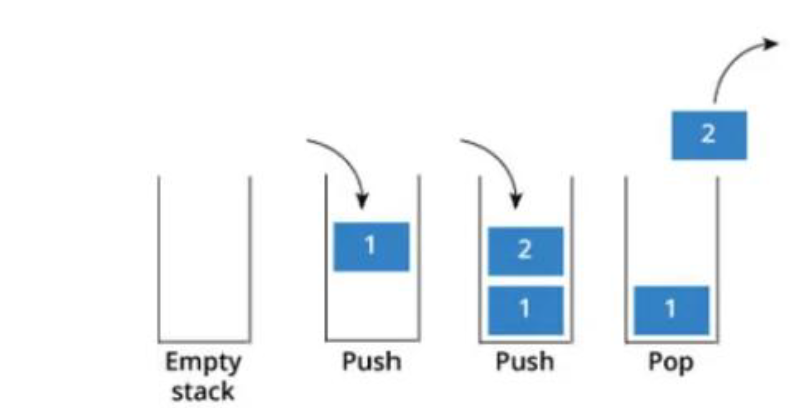
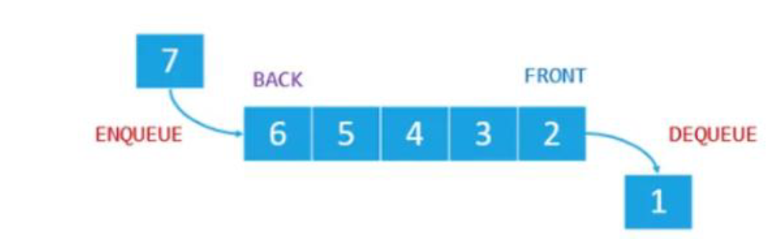

# 堆疊(Stack) vs 佇列(Queue)

## 1️⃣ Description
### Stack
- Stack是一個後進先出（LIFO）的線性結構。
- 新增和刪除都只能在（top）進行。

| 操作 | 意義 |
|------|------|
| Push | 將元素放到堆疊頂端 |
| Pop | 移除堆疊頂端的元素 |

### Queue
- Queue是一先進先出（FIFO）的線性結構。
- 在尾端（rear）加入元素，在前端（front）移除元素。

| 操作 | 意義 |
|------|------|
| Enqueue | 在尾端加入元素 |
| Dequeue | 在前端取出元素 |

## 2️⃣ Visualization 
  
| 堆疊(Stack) | 佇列(Queue) |
|------|------|
|  |  |


## 3️⃣ Practice 
- LeetCode 20 - Valid Parentheses
```c
class Solution {
public:
	bool isValid(string s) {
		stack <char> st;  // 使用 stack 來儲存左括號
		
		// 逐一檢查字串中的每個字元
		for(int i=0;i<s.length();i++){
			if(s[i]=='('||s[i]=='{'||s[i]=='['){ // 若遇到左括號，則推入堆疊
				st.push(s[i]);
			}
			else{ // 遇到右括號
				if (st.empty()) return false; // 若堆疊為空，表示沒有對應的左括號, 回傳false
				else {
					char ch=st.top(); // 取出堆疊頂端的左括號
					st.pop();		  // 移除頂端元素
					
					// 檢查右括號是否與左括號配對
					if((s[i]==')'&&ch!='(')||(s[i]==']'&&ch!='[')||(s[i]=='}'&&ch!='{'))
						return false;
				}
			}
		}
		
		// 若 stack 為空，代表所有括號都成功配對；否則仍有未匹配的左括號
		return st.empty();
	}
};
```

- LeetCode 225 - Implement Stack using Queues
```c
//使用標準佇列（queue）來實作堆疊（stack）
class Stack {
	queue<int> q; //宣告一個 queue 
public:
	// 將元素 x 推入堆疊頂端
	void push(int x) {
		q.push(x); //先把新元素 x 放到佇列尾端
		
		//將前面的元素依序移到尾端，讓新元素變成佇列的最前端
		for (int i=1; i<q.size(); i++) {
			q.push(q.front());	//將佇列最前端的元素放到尾端
			q.pop();	//移除原本最前端元素
		}
	}
	
	//移除堆疊頂端元素
	void pop() {
		q.pop();
	}
	
	//取得堆疊頂端元素
	int top() {
		return q.front();//回傳最前端元素，也就是堆疊頂端top
	}
	
	//判斷堆疊是否為空
	bool empty() {
		return q.empty();
	}
};
```